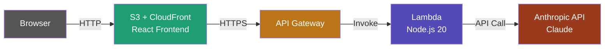

# AI Chat — React + Anthropic API

A streaming chatbot built with React, TypeScript and the Anthropic Claude API.

## Stack

- React 18 + TypeScript (Vite)
- Node.js + Express (proxy server)
- Anthropic Claude API (streaming)

* [Vite](https://vite.dev) - Frontend develop and build tool
* [anthropic-ai](https://github.com/anthropics/anthropic-sdk-typescript#readme) - Claude SDK for TypeScript
* [express](https://expressjs.com/) - Fast, unopinionated, minimalist web framework for Node.js

## Live Demo

https://ai-demo.jduke.org

## Architecture

- Frontend: React + TypeScript on S3 + CloudFront
- Backend: AWS Lambda (Node.js 20, Response Streaming)
- Database: DynamoDB (conversation history)
- AI: Anthropic Claude API (streaming)
- Domain: Custom domain via Route 53 + ACM

## Setup

1. Clone the repo
2. `npm install` in root and `frontend/`
3. Create `.env` with `ANTHROPIC_API_KEY=your-key`
4. `node server.js` + `npm run dev` in frontend/